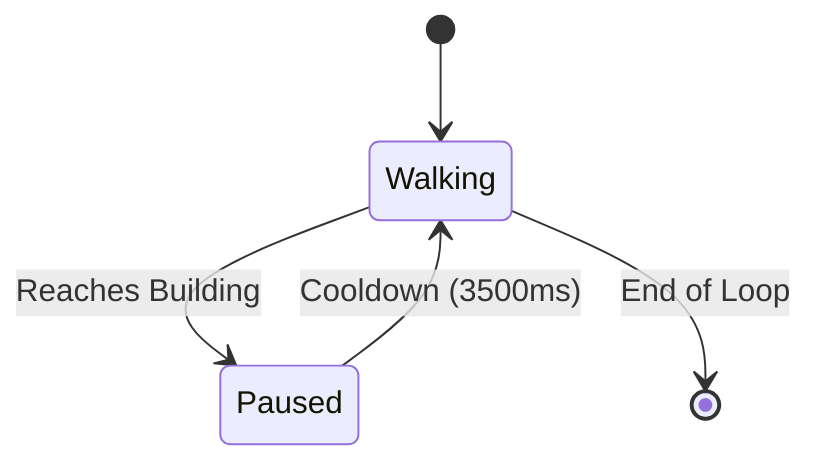

# Omni Skills Olympiad (OSO)

> **Where Learning Meets Opportunity**
> 
> A living, breathing ecosystem designed to connect ambition with real-world application.

---

## 1. Project Vision & Philosophy

The Omni Skills Olympiad landing page isn't just a static interface; it's an interactive masterplan. We built it to immediately communicate that OSO is a deeply connected ecosystem. 

- **The Ecosystem is the Hero:** The environment itself is the primary focus. The abstract learner moves through the world merely to guide the user's eye.
- **Architectural Aesthetic:** We utilize a meticulously handcrafted Isometric SVG engine, favoring the tangible feel of physical architectural models over glossy, game-like 3D.
- **Restrained Motion:** Motion is a premium commodity. It guides attention and communicates interaction without being noisy or decorative. 
- **Performance First:** Complex 3D math is pre-calculated and layered cleanly into DOM nodes, ensuring 60FPS execution on any modern device.

---

## 2. Core Features

### The Living Environment
- **Isometric Canvas:** Procedurally generated buildings and platforms constructed from raw 2D SVG polygons.
- **Embedded Lighting:** As the abstract learner walks, the neutral stone paths illuminate beneath their feet and gracefully fade.
- **Reactive Architecture:** Every building possesses a distinct personality. From the University courtyard softly warming to the Arena's sweeping spotlight, the architecture subtly wakes up when visited.

### Autonomous Learner System
- **Curated Journeys:** The 'meeple' pawn autonomously loops through predefined pathways, showcasing the flow of the platform without requiring user interaction.
- **Smooth Locomotion:** Pure CSS `transition-all` linear interpolation driven by simple React state machines.

---

## 3. Architecture & Rendering

```text
src/
├── components/
│   ├── Ecosystem.jsx       # Isometric rendering engine & state machine
│   ├── About.jsx           # 3D interactive editorial book
│   └── ...                 # Surrounding landing page sections
├── App.jsx                 # Application assembler
└── index.css               # Tailwind & global keyframes
```

### Depth Sorting Pipeline (Z-Buffer)
Because SVG does not natively support true 3D depth buffers, we manually calculate depth:
1. Every object is assigned an absolute coordinate `(x, y)`.
2. Depth is calculated simply as `x + y` (relative distance from the isometric camera).
3. We sort the array of objects by depth and render them back-to-front. This ensures perfect occlusion without expensive WebGL calculations.

### Isometric Math
The entire world is built using a custom trigonometric projection to convert logical 3D coordinates into a 2D screen space:
```javascript
const iso = (x, y, z = 0) => ({
  x: (x - y) * Math.cos(Math.PI / 6) * 45,
  y: ((x + y) * Math.sin(Math.PI / 6) - z) * 45
});
```

---

## 4. Key Design Decisions

### Why SVG over WebGL?
WebGL introduces massive bundle overhead and often feels "game-like." We chose SVG because it provides razor-sharp, handcrafted consistency at any resolution, integrates natively with React state, and aligns perfectly with our premium editorial aesthetic. 

### Why Autonomous Ambient Animation?
Making the user click to move the pawn demands cognitive load. An autonomous learner immediately demonstrates the connectivity of the platform and inspires curiosity without asking the user to do any work.

### Performance Optimizations
- **No Layout Thrashing:** We use GPU-accelerated `transform: translate()` instead of altering DOM `x`/`y` attributes.
- **Memoization:** Complex SVG nodes (like idle buildings) are wrapped in `React.memo` to prevent re-rendering when the learner moves.
- **Intersection Observers:** The autonomous state machine completely halts when the ecosystem scrolls out of the viewport.

---

## 5. State Management & Animation

The ecosystem relies on a localized React state machine to drive the learner.



All animations use **slow acceleration, gentle deceleration, and restrained motion**. We strictly avoid elastic or bouncing eases, heavily favoring `cubic-bezier(0.25, 1, 0.5, 1)` for smooth, architectural transitions.

---

## 6. Development

### Getting Started
```bash
npm install
npm run dev
```

### Build & Deploy
```bash
npm run build
npm run preview
```
Built using Vite. The static output can be deployed effortlessly to Vercel, Netlify, or AWS S3.

---

*Built with passion for the Omni Skills Olympiad. Isometric math and rendering pipeline developed by the OSO Engineering Team.*
